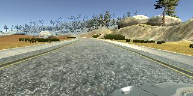
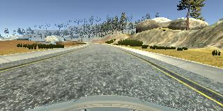
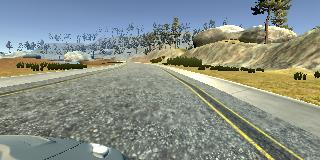
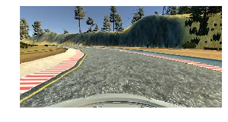
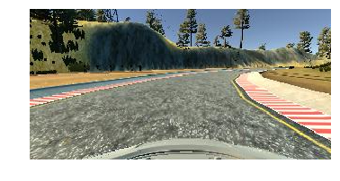
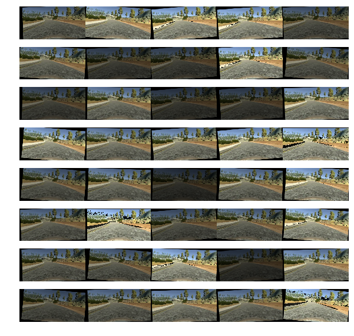
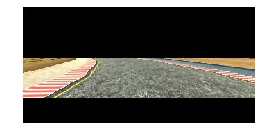
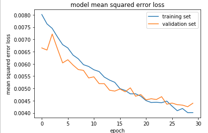

# **Behavioral Cloning Project** 
## 0. Overview

The goals / steps of this project are the following:
* Use the simulator to collect data of good driving behavior
* Build a convolution neural network in Keras that predicts steering angles from images
* Train and validate the model with a training and validation set
* Test that the model successfully drives around track one without leaving the road
* Summarize the results with a written report
* All points from [rubric](https://review.udacity.com/#!/rubrics/432/view) are addressed

## 1. Files Submitted

Project includes the following files:
* model.py containing the script to create and train the model
* drive.py for driving the car in autonomous mode
* model.h5 containing a trained convolution neural network 
* writeup_report.md summarizing the results

## 2. Data Collecion Strategy
In order to collect a sufficient set of data to train the network two styles of driving were collected; center track (left) and recovery (right) driving. The two styles act to train the network what the idea situation is as well as how to respond to undesirable inputs where the car is straying from the track center. To provide data for the center track driving, two laps were recorded in both a clockwise and counter clockwise direction around the track. To model recovery behaviour addition video was recorded with the car returning to the middle from the edge of the track on both straight and corner track segments. Due to the complexities of the bridge and sharp corners with a dirt shoulder, additional passes over these sections were recorded and added to the data sample.

 
 

To ensure quality of data recording was only begun once the car was up to speed and the steering was controlled via mouse input rather than keypad to avoid step respond input. This method was repeated for both tracks and recorded in separate folders to enable specific training for a single track. 

## 3. Data Pre-Processing & Augmentation
### 3.1 Multiple Camera Views
Using three cameras on the car (left/center/right) increases the size of the training data set and adds multiple views to account for different perspectives of the road. Since there are three images and only one set of steering angles an offset was applied to the steering measurement and associated with the left/right images to account for the difference in view.

 
 
 

### 3.2 Mirroring Data Set
To further increase the data set size the images were flipped horizontally and appended to the data set with the negative steering measurement associated to the image. Once all the data was appended, the set was shuffled and returned using a generator.

 
 

### 3.3 Rotate, Translate & Brightness
To further augment the data set to prevent over classifying the network, images were altered by applying a random translation, rotation, and brightness shift. The images were translated up to 5% of their respective width and height, rotated +/-10 degrees, and the brightness shifted by +/-25%. The steering angles remained unchanged.

 

### 3.4 Keras Preprocessing
Using the built in methods of Keras the images were normalized and cropped to further increase the network performance. The images were left as RGB and normalized with a zero mean error between -0.5 to 0.5 for each color. The images were then cropped to remove the top and bottom rows to reduce noise and unwanted artifacts from the hood of the car and scenary unrelated to the road. By applying the normalization and cropping using Keras quite a few lines of code were saved for this project!

 
 

## 4. Model Architecture

### 4.1 Solution Design Approach
The Nvidia Network Architecture was chosen for this project since this seems to be the industry standard for self driving cars at the moment of this writing. The network ... 

### 4.2 Final Model Architecture
The final model was the [NVIDIA Network Architecture](https://devblogs.nvidia.com/parallelforall/deep-learning-self-driving-cars/) with dropout layers added to prevent the network from memorizing the data set.
 
| Layer         		|     Description	        					| 
|:---------------------:|:---------------------------------------------:| 
| Input         		| 160x320x3 Cropped RGB Image							| 
| Normalization     | 							| 
| Convolution 5x5    	| 2x2 stride, valid padding, outputs 24x5x5 	|
| Convolution 5x5    	| 2x2 stride, valid padding, outputs 36x5x5 	|
| Convolution 5x5    	| 2x2 stride, valid padding, outputs 48x5x5 	|
| Convolution 3x3    	| 1x1 stride, valid padding, outputs 64x3x3 	|
| Convolution 3x3    	| 1x1 stride, valid padding, outputs 64x3x3 	|
| Flatten          | outputs 1164   |
| Fully connected		| outputs 100				|
| Fully connected		| outputs 50					|
| Fully connected		| outputs 10					|

## 5. Training the Model
The model used an adam optimizer for 30 epochs that passed the raw training data into a generator in batch sizes of 32 to lighten the load on the working memory of the system. Each batch was preprocessed as described in **Section 3**, shuffled and then returned. 

 

## 6. Simulator Performance
Watch as the car drives around the track by itself!

 

